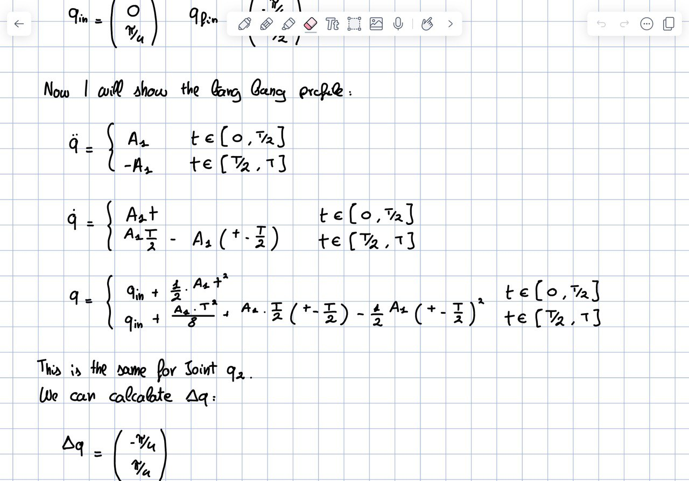
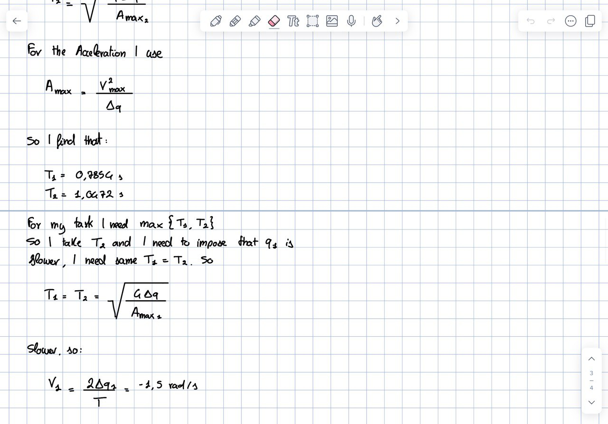
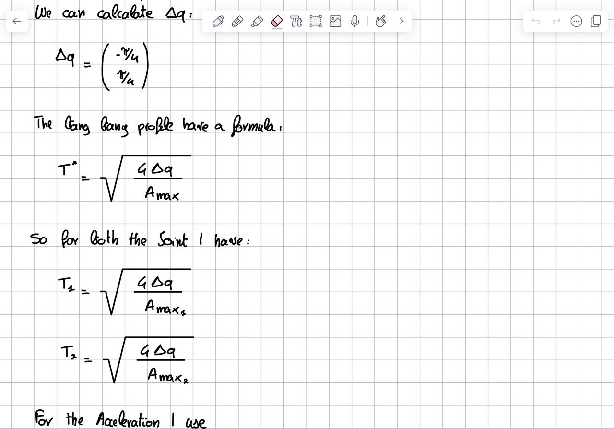
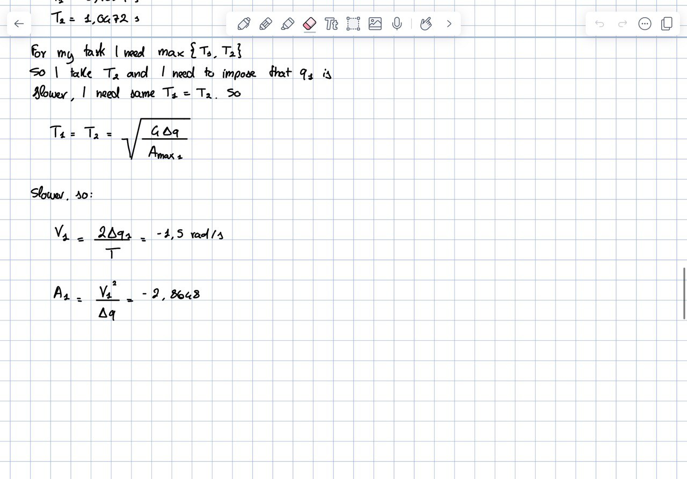

- **NULL SPACE**: quando dobbiamo trovare le velocità nulle.
- **RANGE SPACE**: le velocità feasible.
- **RANGE SPACE complementare = NULL SPACE della Jacobiana trasposta**: rappresenta lo spazio delle forze che il robot può applicare sull'ambiente. Questo è fondamentale per compiti di manipolazione in cui il robot deve applicare forze o momenti specifici.
**FORMULE BANG-BANG**
le formule della bang-cost-bang sono del file Utilis_robotics1
- 
- 
- 
- 
